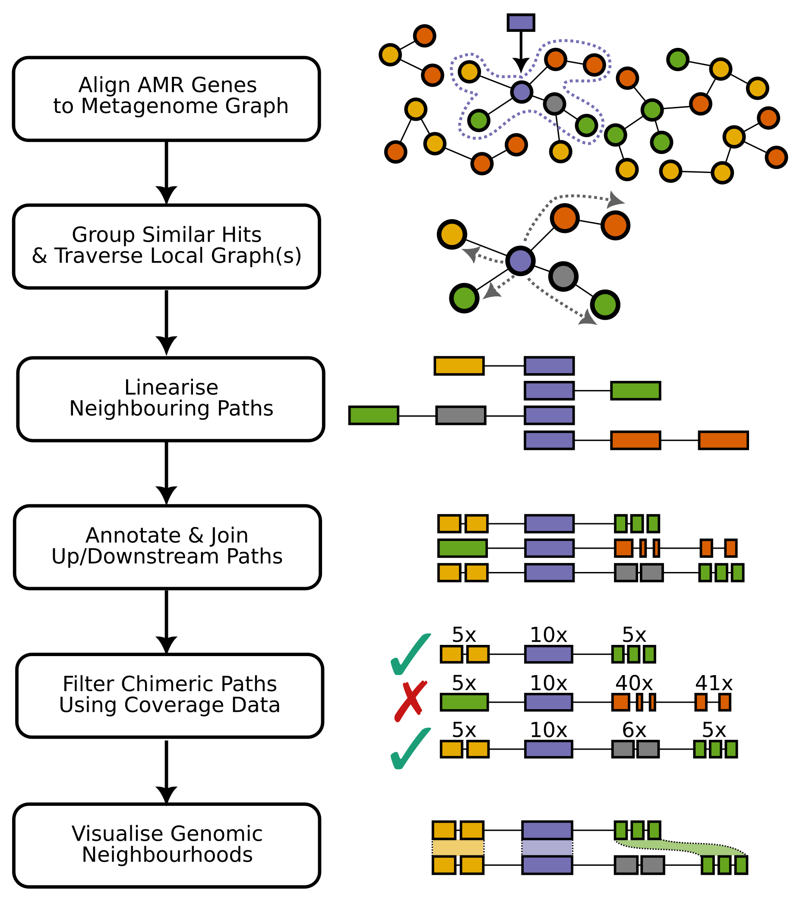

# Sarand


[](https://doi.org/10.5281/zenodo.20394760)


Sarand is a tool to identify genes within an assembly graph and extract the local graph neighbourhood.
It has primarily been developed for the analysis of Antimicrobial Resistance (AMR) genes within metagenomic assembly graphs.
[CARD](card.mcmaster.ca) database is the default set of genes used for which neighborhoods are found but Sarand can support any user-supplied nucleotide fasta file of target genes.
<!--- Currently this is fixed to using the [CARD](card.mcmaster.ca) database but will be expanded in the near future to support any user-supplied nucleotide fasta file of target genes.-->




## 1. Installation

Sarand can be run using a conda environment or in a container (Docker or Singularity) and requires 3 key external dependencies:

- [BLAST+](https://blast.ncbi.nlm.nih.gov/Blast.cgi?PAGE_TYPE=BlastDocs&DOC_TYPE=Download)
- [Bandage](https://github.com/rrwick/Bandage)
- [cd-hit]()

Gene (ORF) calling on the extracted neighbourhoods is performed in-process with
[pyrodigal](https://github.com/althonos/pyrodigal), which is installed as a
Python dependency, so no separate annotation tool or database is required.

### 1a. Docker

This is the easiest way to run Sarand, note that the `-v` argument maps a host directory to the Docker container.
You need to replace `/host/path` and `/container/path` in the command below with the path to the directory containing your input GFA.
Note that this will also be the location that the output is written to.

The most simple way to approach this is by mapping `/host/path` and `/container/path` to the same directory to keep paths consistent.

```shell
docker run -v /host/path:/container/path -it somayeh8131/sarand:1.1.1 -i /container/path/input.gfa -o /container/path/output -a metaspades -k 55
```

### 1b. Singularity

As singularity will automatically map paths, you simply need to run it in the format of:

```shell
singularity run docker://somayeh8131/sarand:1.1.1 -i input.gfa -o output -a metaspades -k 55
```


### 1c. Conda

All of sarand's dependencies are installed into a single conda environment;
Bandage and BLAST+ are simply expected on the `PATH`.

**Creating the environment:**

```shell
conda create -n sarand-1.1.1 -c conda-forge -c bioconda -y blast=2.14.0 bandage=0.8.1 dna_features_viewer=3.1.2 numpy matplotlib-base gfapy=1.2.3 cd-hit=4.6.8 networkx gzip pandas python pillow biopython pyrodigal
```

**Installing sarand:**

```shell
conda activate sarand-1.1.1
# python -m pip install sarand==1.1.1
pip install sarand==1.1.1
```

## 2. Testing

You can test your install has worked by running the test script via `bash test/test.sh`
This will execute sarand on a test dataset (using the following command) and check all the expected outputs are created correctly.

    `sarand -i test/spade_output/assembly_graph_with_scaffolds.gfa -o test/test_output -a metaspades -k 55`


## 3. Usage

All of sarand's parameters can be set using the command line flags.
The only required input file is an assembly graph in `.gfa` format.

This can be generated using metagenomic (or genomic) de-novo assembly tools
such as [metaSPAdes](https://github.com/ablab/spades) or [megahit](https://github.com/voutcn/megahit).
If your chosen assembly tool generates a `fastg` formatted graph utilities such as `fastg2gfa` can be used to convert them.

```
usage: sarand [-h] [-v] -i INPUT_GFA -a ASSEMBLER
              -k MAX_KMER_SIZE [-j NUM_CORES] [-c COVERAGE_DIFFERENCE]
              [-t TARGET_GENES] [-x MIN_TARGET_IDENTITY]
              [-l NEIGHBOURHOOD_LENGTH] [-o OUTPUT_DIR] [-f]
              [--verbose] [--keep_intermediate_files] [--debug]

Identify and extract the local neighbourhood of target genes (such as AMR)
from a GFA formatted assembly graph

optional arguments:
  -h, --help            show this help message and exit
  -v, --version         show program's version number and exit
  -i INPUT_GFA, --input_gfa INPUT_GFA
                      Path to assembly graph (in GFA format) that you wish
                      to analyse
  -a {metaspades,bcalm,megahit,metacherchant,contig},
  --assembler {metaspades,bcalm,megahit,metacherchant,contig}
                      Assembler used to generate input GFA (required to
                      correctly parse coverage information)
  -k MAX_KMER_SIZE, --max_kmer_size MAX_KMER_SIZE
                      Maximum k-mer sized used by assembler to generate
                      input GFA
  --extraction_timeout EXTRACTION_TIMEOUT
                      Maximum time to extract neighbourhood per gene in
                      minutes, -1 indicates no limit
  -j NUM_CORES, --num_cores NUM_CORES
                      Number of cores to use
  -c COVERAGE_DIFFERENCE, --coverage_difference COVERAGE_DIFFERENCE
                      Maximum coverage difference to include when filtering
                      graph neighbourhood. Use -1 to indicate no coverage
                      threshold (although this will likely lead to false
                      positive neighbourhoods).
  -t TARGET_GENES, --target_genes TARGET_GENES
                      Target genes to search for in the assembly graph
                      (fasta formatted). Overrides --database; defaults to
                      the selected --database.
  -d {card,ncbi}, --database {card,ncbi}
                      Reference target-gene database to use when
                      --target_genes is not given. 'card' (bundled,
                      updatable) or 'ncbi' (NCBI AMRFinderPlus; download
                      first with --update --database ncbi). Default: card
  --update            Download/refresh the selected --database to its
                      latest release and exit (no assembly graph required)
  -x MIN_TARGET_IDENTITY, --min_target_identity MIN_TARGET_IDENTITY
                      Minimum identity/coverage to identify presence of
                      target gene in assembly graph
  -l NEIGHBOURHOOD_LENGTH, --neighbourhood_length NEIGHBOURHOOD_LENGTH
                      Size of gene neighbourhood to extract from the
                      assembly graph
  -o OUTPUT_DIR, --output_dir OUTPUT_DIR
                      Output folder for current run of sarand
  -f, --force         Force overwrite any previous files/output     
                      directories
  --verbose           Provide verbose debugging output when logging,
                      and keep intermediate files
  --keep_intermediate_files
                      Do not delete intermediate files.
  --debug               Creates additional files for debugging purposes.
  -seq SEQ_NUMBER, --max_number_seq_for_cdhit SEQ_NUMBER    
  		      Max Number of sequence for cd-hit
  -sim [0 1],  -similarity [0 1]
                     similarity threshold for cdhit (a number between 0 and 1)
  --meta_main_dir METACHERCHANT_MAIN_DIR
  		     The main directory for metacherchant containing
  		     AMR_seqs_full.fasta, all AMR sequences and the
  		     extracted local graphs by metacherchant.
```

**Running for Metacherchant:**

To extract neighborhoods from Metacherchant, you first need to run Metacherchant separately on your set of target genes. For each gene, Metacherchant will generate a local neighborhood graph. However, it does not provide the actual neighborhood sequences. To extract these sequences from the generated local graphs, Sarand must be run on them.

***Required Input Files and Directories***

Ensure that the following items are placed inside a directory, which will be passed to Sarand as `meta_main_dir`:
* `AMR_seqs_full.fasta`: a FASTA file containing all target genes' names and sequences (each in a separate line)
* `AMR_info/sequences`: a directory containing separate files each each named <geneName>.fasta, where each file contains the name and sequence of a target gene.
* `output` a directory generated by Metacherchant containing the local graphs produced for the genes.

***Running Sarand***
Once the required files and directories are set up, execute Sarand for Metacherchant using the following command:
```shell
sarand -o <output_dir> -a metacherchant --meta_main_dir <meta_main_dir>
```

**Running for Contigs:**

To extract neighborhoods from contigs, execute Sarand using the following command:
```shell
sarand -i <contigs_file> -o <output_dir> -a contig
```

**Reference databases (`--database` / `--update`):**

By default Sarand searches for the CARD antimicrobial-resistance genes that are
bundled with the package. Two reference databases of nucleotide target genes are
supported and can be kept up to date without supplying your own `--target_genes`:

* `card` (default) — the [CARD](https://card.mcmaster.ca) protein-homolog model
  nucleotide sequences.
* `ncbi` — the [NCBI AMRFinderPlus](https://ftp.ncbi.nlm.nih.gov/pathogen/Antimicrobial_resistance/AMRFinderPlus/database/latest/)
  reference gene CDS (`AMR_CDS.fa`).

`--update` downloads the latest release of the selected database (only if newer
than the local copy) and exits; the database is cached in a user-writable
directory (`$SARAND_DB_DIR`, else `$XDG_DATA_HOME/sarand`, else
`~/.local/share/sarand`) and used automatically on subsequent runs.

```shell
# refresh the bundled CARD database to the latest release
sarand --update

# download / refresh the NCBI AMRFinderPlus database, then search with it
sarand --update --database ncbi
sarand -i input.gfa -o output -a metaspades -k 55 --database ncbi
```

### 3a. Output
All results will be available in specified output directory (default is `sarand_results_` followed by a timestamp).
Here is the list of important directories and files that can be seen there and a short description of their content:
* `AMR_info`: this directory contains the list of identified AMR sequences.
    * `AMR_info/sequences/`:The sequence of identified AMRs, from graph, is stored here, with a name similar to their original name (file name is generated by calling `sarand/utils.py::restricted_amr_name_from_modified_name(amr_name_from_title(amr_original_name)))`
    * `AMR_info/alignments/`: The alignment details for all AMR sequences are stored here (if `--debug` or `--keep_intermediate_files`).

* `sequences_info/sequences_info_{neighbourhood_length}/`: This directory stores the information of extracted neighborhood sequences from the assembly graph.
    * `sequences_info/sequences_info_{params.neighbourhood_length}/sequences/`: the extracted sequences in the neighborhood of each AMR are stored in a file like `ng_sequences_{AMR_NAME}_{params.neighbourhood_length}_{DATE}.txt`.
For each extracted sequence, the first line denotes the corresponding path, where the nodes representing the AMR sequence are placed in '[]'. The next line denotes the extracted sequence where the AMR sequence is in lower case letters and the neighborhood is in upper case letters.
    * `sequences_info/sequences_info_{params.neighbourhood_length}/paths_info/`: The information of nodes representing the AMR neighborhood including their name, the part of the sequence represented by each node (start position and end position) and their coverage, as well as the entire path coverage is stored in a file like `ng_sequences_{AMR_NAME}_{params.neighbourhood_length}_{DATE}.csv`

* `annotations/annotations_{params.neighbourhood_length}`: The annotation details are stored in this directory. Genes (ORFs) are called with pyrodigal, so each entry records the ORF coordinates; the `gene`/`product` columns are left empty as pyrodigal does not assign functional labels.
    * `annotations/annotations_{params.neighbourhood_length}/annotation_{AMR_NAME}_{params.neighbourhood_length}`: this directory contains all annotation details for a given AMR.
    * `annotation_detail_{AMR_NAME}.csv`: the list of annotations of all extracted sequences for an AMR gene
    * `trimmed_annotation_info_{AMR_NAME}.csv`: the list of unique annotations of all extracted sequences for an AMR gene
    * `coverage_annotation_{COVERAGE_DIFFERENCE}_{AMR_NAME}.csv`: the list of the annotations in which the gene coverage difference from the AMR gene coverage is less than GENE_COVERAGE_DIFFERENCE value.

### 3b. Visualising annotations

Sarand no longer renders annotation comparison images as part of the main run.
A standalone helper script is provided to generate them on demand from any of
the annotation CSVs above (for example `annotation_detail_{AMR_NAME}.csv` or
`coverage_annotation_{COVERAGE_DIFFERENCE}_{AMR_NAME}.csv`):

```shell
python scripts/visualize_annotation.py --csvfile <annotation.csv> --output gene_comparison.png --title "<AMR_NAME>"
```

The script is not installed with the `sarand` package; run it directly from a
checkout. It only needs `dna_features_viewer`, `matplotlib`, `numpy` and
`pillow`, which are already dependencies of sarand.
